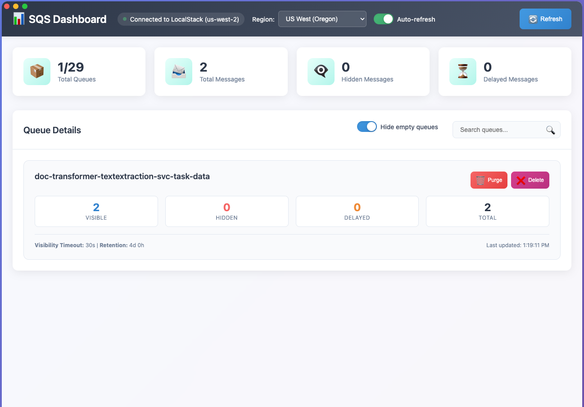

# SQS Dashboard for LocalStack



## Features

- **Real-time Monitoring**: Auto-refreshes every 5 seconds to show current queue metrics
- **Queue Metrics**: 
  - Visible messages (available for processing)
  - Hidden messages (not visible to consumers - in flight)
  - Delayed messages (scheduled for future delivery)
  - Total message count
- **Queue Management**: 
  - Purge queues (clear all messages) with confirmation dialog
  - Delete queues entirely for recreation with confirmation dialog
- **Premium UI**: Modern, responsive design with gradient backgrounds and smooth animations
- **Region Selection**: Choose AWS region with persistence across sessions
- **Connection Status**: Live connection indicator for LocalStack with current region
- **Search & Filter**: 
  - Text search to quickly find specific queues
  - Toggle to hide/show empty queues with persistence
- **Statistics Overview**: Dashboard-style metrics cards

## Prerequisites

- Node.js (v16 or higher)
- LocalStack running on port 4566
- SQS service enabled in LocalStack

## Installation

1. Clone or navigate to the project directory:
   ```bash
   cd sqs-dashboard
   ```

2. Install dependencies:
   ```bash
   npm install
   ```

## Usage

### Development Mode
```bash
npm run dev
```
This opens the app with developer tools enabled.

### Production Mode
```bash
npm start
```

### Building for Distribution
```bash
# Build for current platform
npm run build

# Build for specific platforms
npm run build:mac    # macOS
npm run build:win    # Windows
npm run build:linux  # Linux
```

## LocalStack Setup

Make sure LocalStack is running with SQS enabled:

```bash
# Using LocalStack Pro or Community
localstack start

# Or using Docker directly
docker run -d -p 4566:4566 localstack/localstack
```

The dashboard connects to LocalStack at `http://localhost:4566` by default.

## Queue Message Visibility

The dashboard shows three types of message counts:

- **Visible Messages**: Messages available for consumers to receive
- **Hidden Messages**: Messages that are "in flight" - received by a consumer but not yet deleted/processed
- **Delayed Messages**: Messages scheduled for future delivery

Hidden messages are particularly useful for monitoring processing queues where messages may be temporarily invisible while being processed.

## Features in Detail

### Dashboard Overview
- Real-time statistics cards showing totals for visible queues (respects filters)
- Region selector dropdown in header with persistence across sessions
- Empty queue filter toggle with persistence across sessions
- Auto-refresh toggle with persistence across sessions
- Connection status indicator (green = connected, red = disconnected) with current region display
- Auto-refresh every 5 seconds (when enabled)

### Queue Cards
Each queue displays:
- Queue name and total message metrics
- Breakdown of visible/hidden/delayed messages
- Queue configuration (visibility timeout, retention period)
- Last update timestamp
- Purge button (only enabled when messages exist)
- Delete button (always enabled)

### Queue Management
**Purge Queue:**
- Clears all messages from the queue but keeps the queue itself
- Safe purge operation with confirmation dialog
- Shows queue name and warning message
- Cannot be undone - use with caution
- Button is disabled when queue is empty

**Delete Queue:**
- Completely removes the queue from SQS
- Useful for recreating queues with different configurations
- Strong confirmation dialog with warning
- Cannot be undone - queue must be recreated manually
- Always enabled regardless of message count

### Region Management
**Region Selection:**
- Dropdown in header allows switching between AWS regions
- Includes all major AWS regions (US, EU, Asia Pacific, Canada)
- Automatically reconnects SQS client when region changes
- Selected region persists across application sessions
- Connection status shows current region
- Default region is `us-west-2` but can be changed and will be remembered

**Supported Regions:**
- US East (N. Virginia) - `us-east-1`
- US East (Ohio) - `us-east-2`
- US West (N. California) - `us-west-1`
- US West (Oregon) - `us-west-2` (default)
- Europe (Ireland) - `eu-west-1`
- Europe (London) - `eu-west-2`
- Europe (Paris) - `eu-west-3`
- Europe (Frankfurt) - `eu-central-1`
- Asia Pacific (Singapore) - `ap-southeast-1`
- Asia Pacific (Sydney) - `ap-southeast-2`
- Asia Pacific (Tokyo) - `ap-northeast-1`
- Canada (Central) - `ca-central-1`

### Queue Filtering
**Search Filter:**
- Text input in section header for finding specific queues
- Real-time filtering as you type
- Searches queue names (case-insensitive)
- Works in combination with empty queue filter

**Empty Queue Filter:**
- Toggle switch in section header: "Hide empty queues"
- When enabled, only shows queues with at least one message (visible, hidden, or delayed)
- Helps focus on active queues and reduces screen clutter
- Preference persists across application sessions
- Statistics update to reflect only visible queues
- Queue count shows "filtered/total" when filter is active

**Combined Filtering:**
- Both filters work together seamlessly
- Search + empty filter shows only non-empty queues matching search term
- Statistics cards reflect the currently visible queues after all filters

### Auto-Refresh Control
**Auto-Refresh Toggle:**
- Toggle switch in header to enable/disable automatic data refreshing
- When enabled, refreshes queue data every 5 seconds
- When disabled, data only updates on manual refresh or user actions
- Subtle "Auto-refreshing..." indicator appears briefly during background updates
- Preference persists across application sessions
- Enabled by default for real-time monitoring

**Manual Refresh:**
- Refresh button always available regardless of auto-refresh setting
- Shows full loading overlay for user feedback
- Immediately updates all queue data and statistics

**Benefits:**
- **Battery Saving**: Disable auto-refresh on laptops to save battery
- **Controlled Updates**: Stop automatic refreshing during maintenance or testing
- **Reduced Network**: Minimize API calls when continuous monitoring isn't needed
- **Focus Mode**: Prevent distracting updates during detailed queue analysis

## Configuration

The app is configured to connect to LocalStack with these defaults:
- **Endpoint**: http://localhost:4566
- **Default Region**: us-west-2 (changeable via UI)
- **Credentials**: test/test (LocalStack defaults)

To modify the endpoint or credentials, edit the `getLocalStackConfig` function in `src/main.js`.
The region can be changed directly from the UI and will persist automatically.

## Troubleshooting

### Connection Issues
1. Ensure LocalStack is running: `docker ps` or `localstack status`
2. Check if SQS service is available: `curl http://localhost:4566/_localstack/health`
3. Verify port 4566 is accessible

### No Queues Showing
1. Create test queues in LocalStack:
   ```bash
   aws --endpoint-url=http://localhost:4566 sqs create-queue --queue-name test-queue
   ```
2. Check the connection status indicator in the app header

### Performance
- The app refreshes every 5 seconds by default
- Large numbers of queues may impact performance
- Search/filter functionality helps with many queues

## Development

The project structure:
```
sqs-dashboard/
├── src/
│   ├── main.js        # Electron main process
│   ├── preload.js     # Preload script for security
│   ├── index.html     # Main UI
│   ├── styles.css     # Premium styling
│   └── app.js         # Frontend application logic
├── package.json       # Dependencies and scripts
└── README.md         # This file
```

Key technologies:
- **Electron**: Desktop app framework
- **AWS SDK v3**: SQS client for LocalStack
- **Vanilla JS**: No additional frontend frameworks
- **CSS Grid/Flexbox**: Responsive layout

## License

MIT License - feel free to modify and distribute.
